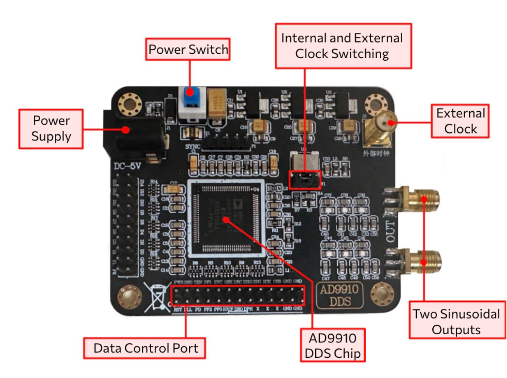
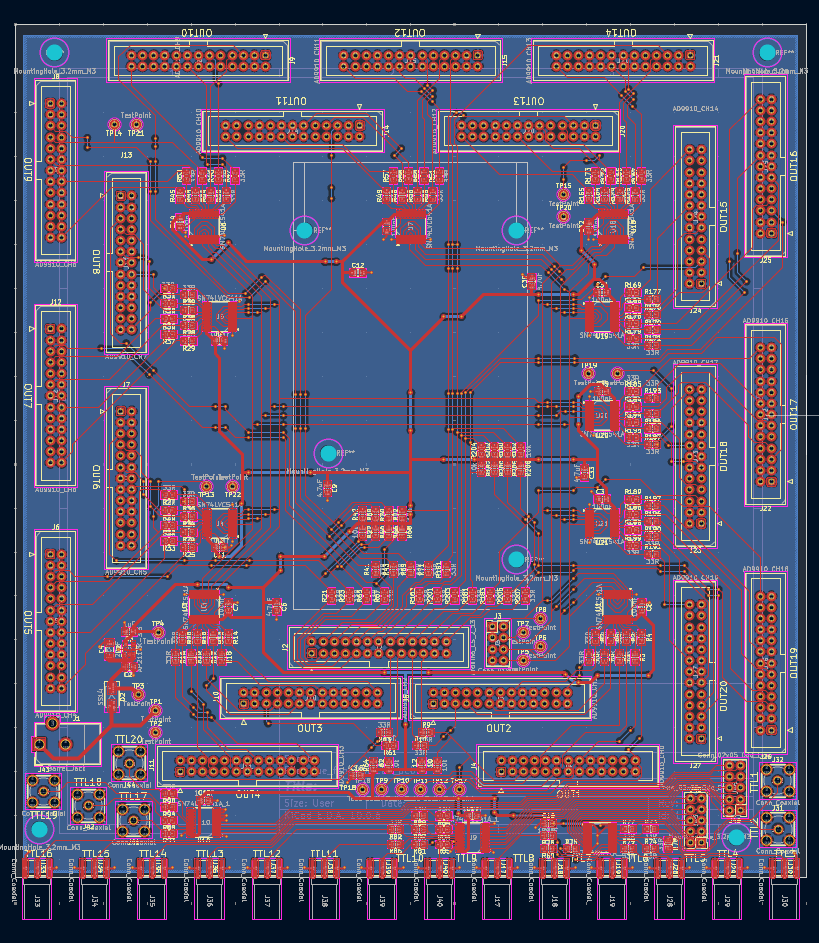
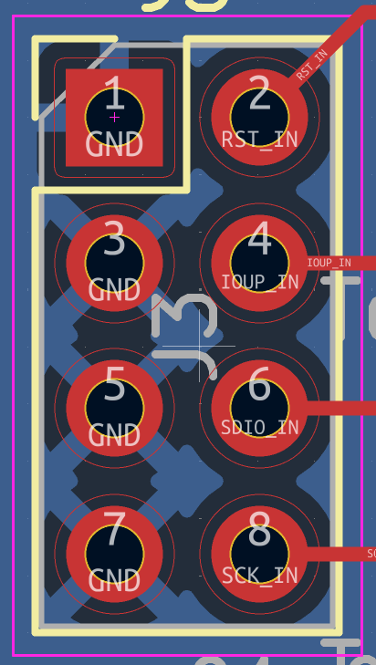

# AD9910 Mixed-Clock GUI — User Manual

## 1. Overview

This application controls up to 20 AD9910 modules through one Arduino Due. Each enabled DDS has independent frequency, amplitude, phase, clock selection and an internal RF switch. Enabled channels are always the consecutive group DDS 1 through DDS N.

Use this GUI with `AD9910_Due_Mixed/AD9910_Due_Mixed.ino` in this folder (mixed-clock protocol 3). The other GUI's firmware is not interchangeable.

| Parameter | Accepted input |
| --- | --- |
| Frequency, Hz | Whole numbers, 0–499999999 Hz; corrected frequency must also remain in range |
| Frequency, MHz | Whole numbers, 0–499 MHz; use Hz for finer resolution |
| Amplitude | 0–1, normalized DDS amplitude scale, not calibrated RF power |
| Phase | 0 inclusive to 360 exclusive, in degrees |
| Enabled DDS | 1–20 |
| Clock | INTERNAL (independently for each DDS) or EXTERNAL |

At initialization and reset, frequency is 100 MHz, amplitude is 0 and phase is 0°. Enabled Internal Shutters open; disabled shutters remain closed. Frequency 0 forces the effective DDS amplitude to zero.

## 2. Hardware setup

The existing system consists of 20 AD9910 modules, one Arduino Due, 20 TB-M3SWA250DRB+ digital RF switches, one Arduino breakout board, and four physical-switch/power-supply boards.

### 2.1 AD9910 module and clock



The module provides complementary RF outputs labeled IOUT and its complement. Route these according to the installed RF chain; the GUI does not select or combine the connectors. Frequency, phase and amplitude are programmed through the control header.

| GUI selection | Required module setup | Firmware clock setup |
| --- | --- | --- |
| INTERNAL | Set the module's Internal/External Clock Switching selector to Internal | 40 MHz reference, PLL ×25 |
| EXTERNAL | Set the selector to External and supply a direct 1 GHz reference at External Clock SMA | PLL disabled |

Both modes use a nominal 1 GHz system clock. Set up each module's physical reference before initialization. GUI clock choices program the DDS registers; they do not move physical selectors or detect clock presence. A common IO_UPDATE does not establish RF phase coherence between independent clocks.

### 2.2 Arduino Due and pin mapping

Connect the computer to the Due's **Programming Port**, which is used for upload, serial communication and USB power to the Due. Supply the modules and switch boards through their installed power system. Use a common ground.

SPI data, clock, IO_UPDATE and RESET are shared; each DDS has a separate chip-select and Internal Shutter output.

| Signal | Arduino connection |
| --- | --- |
| SDIO / MOSI | Central SPI header MOSI |
| SCK | Central SPI header SCK |
| IO_UPDATE | D25 |
| RESET | D24 |
| CS, DDS 1→20 | 35, 37, 39, 41, 47, 49, 51, 53, 52, 50, 48, 46, 44, 42, 40, 38, 36, 34, 32, 30 |
| Internal Shutter, DDS 1→20 | 2, 3, 4, 5, 6, 7, 8, 9, 10, 11, 14, 15, 16, 17, 18, 19, 20, 21, 22, 23 |

D0/D1 are reserved for Programming Port serial. D31/D33/D43/D45 remain externally grounded and are not driven by this firmware. The existing wiring also grounds PF0/PF1/PF2. External 10 kΩ shutter pull-downs keep high-impedance pins LOW; they cannot override an actively driven HIGH pin after a communication failure.

### 2.3 RF switch control

Each RF path has a digital switch. In this system, Arduino LOW closes the switch and HIGH (3.3 V) opens it. The front-panel physical selector chooses the TTL source: Arduino (internal) or FPGA (external).

**Clock selection and shutter-source selection are separate settings.** The GUI's Internal Shutter controls only the Arduino TTL output. When the physical selector chooses FPGA control, manage the RF switch from that external system.

### 2.4 Breakout board



The breakout board distributes and buffers the control signals. DDS IDC pin 1 is the GND pin on the CSB side of the module header. The first CS-connection pin is GND next to Arduino pin 53. Verify connector orientation against the board image before connecting.

In the SPI section, the left column is GND. The right column is RESET, IO_UPDATE, SDIO and SCK from top to bottom.



## 3. Software installation and launch

1. Install Python 3.10 or newer with Tkinter.
2. Install Arduino CLI. Install the Arduino SAM Boards core using:

   ```powershell
   arduino-cli core update-index
   arduino-cli core install arduino:sam
   ```

3. From the repository root, install the Python dependencies and launch:

   ```powershell
   python -m pip install -r AD9910_GUI_MixedClock/requirements.txt
   python AD9910_GUI_MixedClock/ad9910_gui.py
   ```

Keep the repository layout intact. This GUI imports the root-level `frequency_corr.py` and reads the shared `AD9910_GUI/frequency_correction.txt`. Dependencies include PySerial and NumPy. Close other serial monitors before connecting or uploading.

## 4. Initialization window

> **Screenshot placeholder — Initialization window**  
> Insert a screenshot showing file selection, Programming Port, Enabled DDS, the per-DDS clock selectors, All INTERNAL / All EXTERNAL, and the initialization button.

<!-- Replace the placeholder above with:  -->

The initialization window opens automatically at startup and can be reopened with **Initialization...** in the main window.

| Control | Purpose |
| --- | --- |
| Arduino CLI / Browse... | Select the `arduino-cli` executable, or enter its command/path |
| Firmware (.ino) / Browse... | Select this folder's `AD9910_Due_Mixed/AD9910_Due_Mixed.ino` |
| Programming Port / Refresh | Select the Due's Programming Port; refresh after plugging it in |
| Enabled DDS | Choose N; only DDS 1…N will be enabled |
| Per-DDS clock selectors | Choose INTERNAL or EXTERNAL for each channel |
| All INTERNAL | Set all 20 clock selectors to INTERNAL |
| All EXTERNAL | Set all 20 clock selectors to EXTERNAL |
| Compile, upload & initialize | Compile and upload firmware, reconnect, then configure the enabled channels and their clocks |
| Cancel | Close this window while initialization is idle |
| Status text | Show initialization progress or an error |

For a uniform clock setup, click **All INTERNAL** or **All EXTERNAL**. For a mixed setup, use either button as a starting point, then change individual selectors. Bulk selection includes disabled channels so that later increases in N retain that choice; only the first N selections are submitted. Changing a selector alone does not reconfigure hardware.

Before clicking **Compile, upload & initialize**, verify the physical clock selection and reference on each enabled module. Wait for completion; the window closes and the main status shows the enabled range and clock map (`I` = INTERNAL, `E` = EXTERNAL). Changes made after an initialization starts do not alter its captured configuration.

Successful configuration saves paths, port, enabled count and clock selections in `initialization_config.json` for the next launch. Output frequency, amplitude and phase are not restored from that file. Upload/configuration resets outputs to the defaults described in Section 1.

If the matching firmware is already installed, you may close this window, use **Connect**, wait for the handshake, then click **Configure**. This applies the selected count and clock choices without uploading again, and also resets output parameters.

## 5. Main control window

> **Screenshot placeholder — Main control window**  
> Insert a screenshot showing connection controls, toolbar, DDS parameter rows, Internal Shutters and serial log.

<!-- Replace the placeholder above with:  -->

### 5.1 Connection and toolbar

| Control | Behavior |
| --- | --- |
| Programming Port / Refresh | Select or refresh the serial device list |
| Connect / Disconnect | Open or close the Programming Port connection; connecting normally resets the Due |
| Enabled DDS / Configure | Configure DDS 1…N with the selected clock map; reset their output parameters |
| Auto apply | After Set or Set all, issue a common update so buffered parameters take effect |
| Set all | Validate and send frequency, amplitude and phase for every enabled row; apply immediately only if Auto apply is on |
| APPLY ALL | Send every enabled row's current values, then issue one common IO_UPDATE |
| Read status | Request firmware-reported state and display it in the serial log |
| Reset to defaults | Immediately reset configured channels without a confirmation dialog |
| Close all Internal Shutters | Immediately drive every enabled Arduino shutter output LOW |
| Initialization... | Reopen the initialization window |

**Reset to defaults** retains the enabled count and clock map, sets F=100 MHz, A=0 and P=0, and opens enabled Internal Shutters. The GUI fields reset when firmware acknowledges the command. Reset does not upload firmware and does not apply frequency calibration to its built-in 100 MHz default.

Disconnect and normal application exit attempt to close the configured Internal Shutters before closing the serial port. This is a best-effort action and cannot guarantee closure if communication is already lost.

### 5.2 DDS rows

| Field/control | Operation |
| --- | --- |
| DDS | Channel number, matching hardware CS and shutter numbering |
| Frequency + Hz/MHz | Enter the requested frequency; whole numbers only |
| Amplitude | Enter a normalized value between 0 and 1 |
| Phase (deg) | Enter a value from 0 to less than 360 |
| Internal Shutter / Open | Checked = HIGH/open; unchecked = LOW/closed; acts immediately |
| Set | Send that row's frequency, amplitude and phase; apply immediately only if Auto apply is on |

Pressing **Enter** in a frequency, amplitude or phase field performs that row's **Set** action. Spinbox arrows repeat while held; with Auto apply enabled each arrow change sends and applies that row. Typing alone does not send values: use Enter, Set, Set all or APPLY ALL. Changing the frequency unit only changes the editable value.

Switching from Hz to MHz rounds to the nearest whole MHz (half upward), which can change the requested frequency. A conversion that would produce 500 MHz is rejected. Keep Hz selected for fine adjustments.

With Auto apply off, Set and Set all write buffered parameters. **APPLY ALL always resends all enabled GUI rows** before updating. The update pulse is shared: Auto apply after one row's Set can also activate parameters previously buffered for other rows. For a coordinated multi-channel change, leave Auto apply off, edit all required rows and click APPLY ALL once.

Disabled DDS rows cannot be edited. Invalid input or calibration blocks the affected submission and reports an error. Set all/APPLY ALL stop at the first invalid row; earlier rows may already be buffered, but no final update is issued. Correct the error and retry APPLY ALL to synchronize all rows.

### 5.3 Serial log and status

The log shows outgoing commands (`>`) and incoming responses (`<`), including the actual corrected frequency sent to the firmware. Read status reports commanded/buffered state; it is not a measurement of RF output, a register readback, or confirmation of PLL lock. It does not replace the requested frequency shown in the input field.

## 6. Typical operating procedure

1. Prepare power, wiring, physical clock sources and the RF-switch control-source selectors.
2. Launch the GUI and initialize the desired DDS count and clock map.
3. Leave Auto apply off while preparing several channels. Enter frequencies, amplitudes and phases. Use Hz for exact frequency requests.
4. Click APPLY ALL to submit and update the enabled channels together.
5. Use each Internal Shutter checkbox, or Close all Internal Shutters, to control the Arduino-selected RF paths immediately.
6. Use Read status and the serial log to inspect the commanded state. Verify actual RF output with the measurement equipment used by your setup.
7. For individual adjustments, optionally enable Auto apply and use Set, Enter or spinbox arrows.
8. To return to defaults, click Reset to defaults once; it acts immediately without confirmation. To finish, close shutters as needed and disconnect.

## 7. Frequency calibration

Both GUI versions share `AD9910_GUI/frequency_correction.txt`. The first CSV row starts with ID `0`, followed by reference frequencies in Hz. Each later row starts with a DDS ID (1–20), followed by the corresponding frequency errors in Hz:

```text
0,0,25e6,50e6,...
1,0,-357,-704,...
2,0,-72,-143,...
```

This is a format illustration; replace `...` with numeric data in an actual file. References must be finite, nonnegative and strictly increasing. Each error row must have the same number of samples as the reference row, and DDS IDs must be unique. Rows are matched by ID, not position. A requested DDS must have a calibration row; zero errors give an identity correction.

The shared `frequency_corr.py` fits `error = k * reference + b` and computes:

```text
sent_frequency = round(requested_frequency² /
                       (k * requested_frequency + b + requested_frequency))
```

The GUI retains the requested value and sends corrected integer Hz. Zero Hz stays zero. Both the requested and corrected frequency must be within 0–499999999 Hz. Missing/invalid calibration, an invalid denominator or an out-of-range result blocks submission; the GUI does not silently clip values or bypass correction.

The calibration file is read at each frequency submission, so changes take effect without restarting. Finish editing and saving the file before submitting parameters. Firmware initialization, Configure and Reset retain their built-in, uncorrected 100 MHz default; use Set or APPLY ALL afterward to apply correction to the displayed request.

## 8. Troubleshooting

| Symptom | Check/action |
| --- | --- |
| Python reports a missing module | Install this folder's requirements using the same Python interpreter used to launch the GUI |
| No Programming Port listed | Check USB cable/connection and the selected Due port, then click Refresh |
| Port cannot be opened or upload fails | Close other serial monitors; check CLI path, firmware path, SAM core and Programming Port selection |
| GUI connects but configuration stays unavailable | Confirm the installed firmware is this folder's mixed-clock protocol 3 version; upload it through Initialization... |
| Initialization/configuration error | Read the status message and serial log; verify count, firmware and selected clock map, then retry |
| Set does not change RF output | With Auto apply off, click APPLY ALL; also check amplitude, physical clock and shutter-source selector |
| Internal Shutter does not control the RF path | Check whether the front-panel selector is set to external FPGA control |
| Frequency correction error | Check the shared calibration file, channel ID and numeric samples; reduce a request if its corrected value exceeds the DDS limit |
| Requested and logged frequencies differ | This is expected with calibration; the field is the target and the outgoing F command is the corrected value |
| No output after reset/initialization | Amplitude defaults to zero; set a suitable amplitude and apply the values |

## 9. Serial protocol reference

Normal operation uses the GUI. For diagnostics, the Programming Port protocol uses 115200 baud and newline-terminated commands. DDS numbering is 1–20.

```text
CONFIG 3 IEI
F 1 100000000
A 1 0.1
P 1 90
APPLY ALL
SHUTTER 1 0
STATUS
RESET
```

CONFIG requires exactly N letters (`I` = INTERNAL, `E` = EXTERNAL), ordered DDS 1…N. The full map is validated before hardware changes. Example acknowledgement: `OK CONFIG ACTIVE=3 CLOCKS=IEI`. F/A/P are buffered until APPLY ALL; SHUTTER acts immediately. Raw F commands already represent the programmed frequency: calibration is performed by the GUI, not by firmware.

DATA CH reports each channel's clock, reference, CFR3 and output state. Firmware uses SPI Mode 0 at 10 MHz; INTERNAL CFR3 is `0x0538C132`, EXTERNAL CFR3 is `0x073FC000`, CFR1 is `0x00000002`, and CFR2 is `0x01000020`.

## Appendix

Some details about AD9910 board.

Pin name and function

|PIN Name |Name on Chip | Function|
| --- | --- | --- |
|DC Barrel Jack| \ |5V Power supply. Recommend >1A, standard 390mA, max 400mA|
|PWR |EXT_PWR_DWN |Power-down control pin. Digital input. Setting this pin high (3.3V) disables the chip; connect to ground if not used.|
|SDIO |SDIO  |Serial data input/output.|
|DPH |DRHOLD |Digital ramp hold. Digital input. Active high (3.3V); connect to ground if not used.|
|DRO |DROVER |Digital ramp complete. Digital output (active high).|
|IOUP |I/O UPDATE |Synchronization signal (LVDS), digital input (active on the rising edge). Apply a high-level pulse after writing to registers.|
|PF0 PF1 PF2|PROFILE[2:0]|Profile selection pin. Digital input (active high).|
|RST |MASTER RESET |Host reset, digital input (active high).|
|SCK |SCLK |Serial data clock. Digital clock (write operations performed on the rising edge, read operations on the falling edge)|
|DRC |DRCTL |Digital ramp control. Control the slope polarity of the digital ramp generator; ground the pin if not in use.Digital input. |
|OSK |OSK |Output Amplitude Shift Keying. Digital input.|
|CSB |CS+I/O_RESET| Digital input. SPI communication CS control pin and communication reset pin.
|GND | GND|	The control board and the AD9910 module must share a common ground.
|Other| Other| For any pins on the module that are not explicitly described but are present, they may be left floating if unused; please refer to the datasheet for functional details.|
